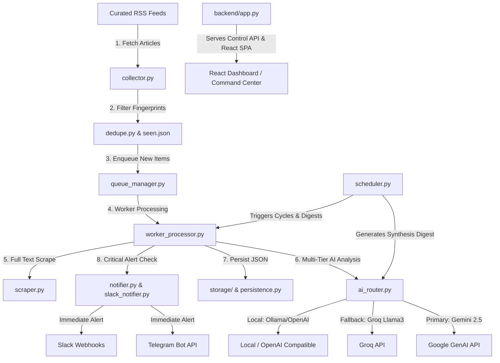

# Architecture Overview

JARVIS is an automated security intelligence collection, AI analysis, synthesis reporting, and notification system.

## High-Level Architecture Diagram

## System Subsystems

1. **Collector & Ingestion (`collector.py`, `scraper.py`)**:
   - Reads active sources from SQLite control plane database (`jarvis_db.py`).
   - Validates HTTP/HTTPS URL schemes.
   - Parses RSS feeds (`feedparser`) and scrapes full text HTML body where available.

2. **Deduplication & In-Memory Queue (`dedupe.py`, `queue_manager.py`)**:
   - MD5 fingerprint generation from `(title + link)`.
   - Single-load memory cache per cycle flushed at cycle completion to eliminate disk I/O bottlenecks.
   - Thread-safe ephemeral queue for article processing.

3. **Multi-Tier AI Router (`ai_router.py`)**:
   - Dynamic provider selection based on task severity (Premium, Digest, Article, Text).
   - Rate slot wait locks for Gemini (`gemini-2.5-flash`, `gemini-2.5-pro`) and Groq (`llama-3.1-8b-instant`, `llama-3.3-70b-versatile`).
   - Support for Ollama local endpoints and OpenAI-compatible custom routes.
   - Automatic provider rate-limit blocking and fallback routing.

4. **Persistence & Data Storage (`storage/persistence.py`, `jarvis_db.py`)**:
   - Transactional SQLite control plane database for user authentication, source feeds, model providers, notification channels, MCP servers, and event logs.
   - Directory-based JSON persistence for raw articles (`/data/raw_articles`), processed articles (`/data/processed`), daily digests (`/data/daily`), and archives (`/data/archive`).
   - Legacy data bridge mounting legacy directories read-only.

5. **Notification Engine (`notifier.py`, `slack_notifier.py`)**:
   - Multi-channel delivery to Telegram chats and Slack webhooks.
   - Automatic payload splitting for long messages (>4000 characters).
   - Multi-attempt exponential backoff for network or SSL glitches.

6. **Web Application & Command Center (`backend/app.py`, `frontend/`)**:
   - Flask backend providing REST control plane, JWT auth, security headers, and static SPA serving.
   - React + Vite single-page dashboard featuring real-time telemetry, queue progress, AI provider status, and an interactive Command Center / Testing page.
